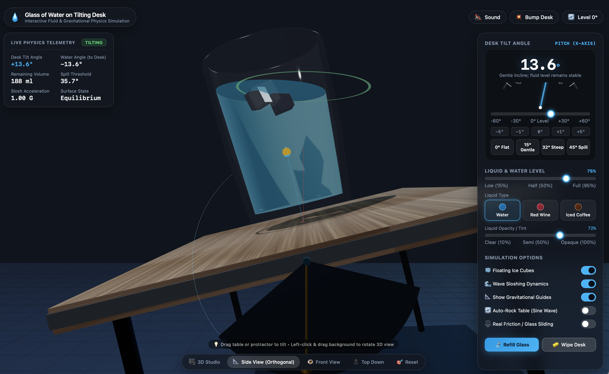

# Glass on Tilting Desk — 3D Physics Simulation

An interactive 3D WebGL physics and fluid dynamics simulation of a glass of liquid resting on a tilting desk, powered by [Three.js](https://threejs.org/).



## 🌐 Live Demo

👉 **[Launch Live Simulation](https://privateifox.github.io/glassTilt/)** *(enable GitHub Pages in repository settings)*

---

## ✨ Features

- **Fluid Slosh Dynamics:** Real-time harmonic spring-damper simulation that reacts dynamically to desk tilt acceleration and inertia.
- **Spill & Droplet Particles:** Fluid spills when the water line breaches the glass rim, actively recalculating remaining liquid volume and spawning droplet particles.
- **Multiple Liquid Presets:**
  - 💧 **Pure Spring Water**
  - 🍷 **Cabernet Red Wine** (higher viscosity & damping)
  - ☕ **Iced Cold Brew**
- **Interactive Controls:**
  - Shift + Left Click & Drag the desk or protractor dial directly in 3D space to tilt.
  - On-screen precision angle controls & auto-rocking mode.
  - OrbitControls to pan, orbit, and zoom around the scene.
- **Camera Presets:**
  - 🎥 3D Studio perspective
  - 📐 Orthographic Side View
  - 👁️ Front View
  - 🔝 Top Down View
- **Real-Time Telemetry HUD:** Live telemetry monitoring desk tilt angle, fluid volume (mL), spill rates, and stability thresholds.
- **Procedural Audio:** Sound synthesis utilizing the Web Audio API for fluid motion and spilling.
- **Zero Build Setup:** Pure vanilla HTML/JS with CDN-loaded Three.js — no build tools, bundlers, or package managers required.

---

## 🚀 Getting Started

Simply open `index.html` directly in any modern browser:

```bash
# Clone the repository
git clone git@github.com:PrivateiFox/glassTilt.git
cd glassTilt

# Open directly in your browser
open index.html
```

Or run a lightweight local static server:

```bash
# Using Python
python3 -m http.server 8000

# Or using Node
npx serve .
```

---

## 📜 License

Distributed under the [MIT License](LICENSE).
